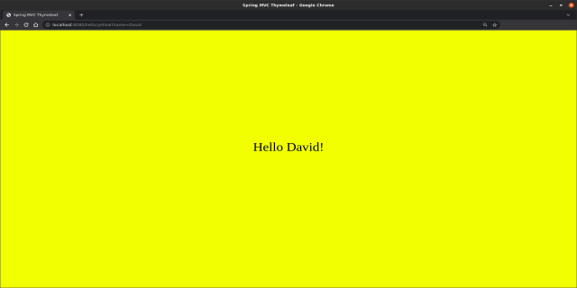

# spring-mvc-thymeleaf

## HOW TO RUN
```shell
$ ./mvnw spring-boot:run
```

## HOW TO TEST
http://localhost:8080/hello/yellow?name=David


<br>

http://localhost:8080/hello/green?name=David


<br>

http://localhost:8080/hello/blue?name=David
